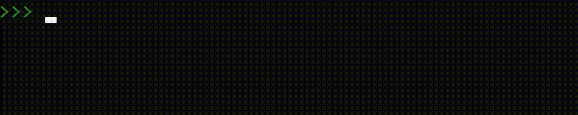

<h2> 𝐇𝐞𝐥𝐥𝐨 𝐭𝐡𝐞𝐫𝐞, 𝐟𝐞𝐥𝐥𝐨𝐰 <𝚍𝚎𝚟𝚎𝚕𝚘𝚙𝚎𝚛𝚜>! </h2>

  
  

  
  
     

Looks like you've stumbled upon my Github profile.  
Feel free to contact me with my <a href="mailto:tyler.trott@atsign.com"><b>email</b></a>

<i>Happy Coding!</i> 😊

 

📈 My Github stats  

    
   
   
  

Check out my LinkedIn!

